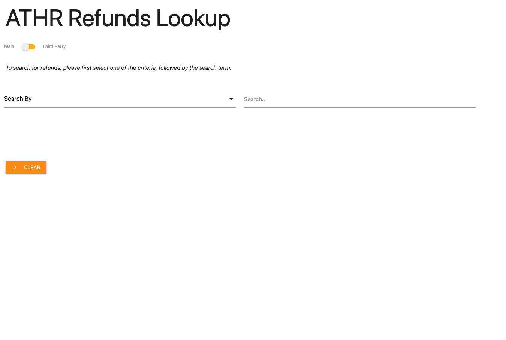

# look-up-tool
A Google Apps Script WebApp that looks up entries based on different parameters, reading from a preloaded JSON file

## Table of Contents

* [Technologies](#technologies)
* [Installation](#installation)
* [Features](#features)
* [Questions](#questions)

## Technologies 

* Google Apps Script
* JavaScript ES6
* HTML5
* CSS3
* clasp

## Installation

To install this application, in VS code after cloning the repo, use [clasp CLI](https://developers.google.com/apps-script/guides/clasp) to create the .clasp.json file

``
clasp create [scriptTitle]

``

Then add the destination script id to the .clasp.json file and then push the code using the following command

``
clasp push

``

## Features

* Fast data fetching and looking up
* Different Criteria to look up entries
* Displays results in a table with dynamic columns that woould appear based on conditions
* Relies on a simple JSON file storage scheme that includes an index file
* Switch between 2 databases

## Questions 

If you have any more questions, please contact me here:

Github Username: [mohamedallam13](https://mohamedallam13.github.io/react-professional-portfolio/)

Email: [mohamedallam.tu@gmail.com](mailto:mohamedallam.tu@gmail.com)

